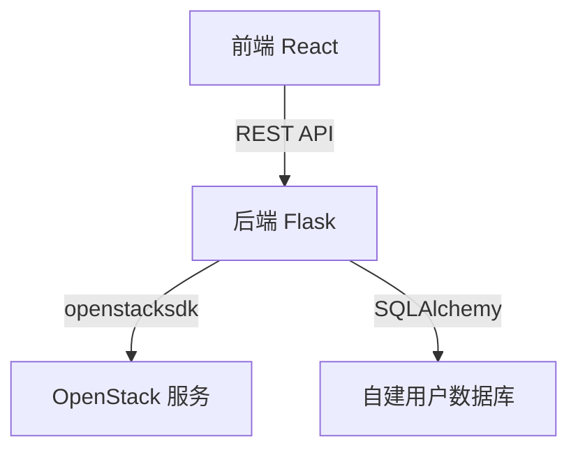
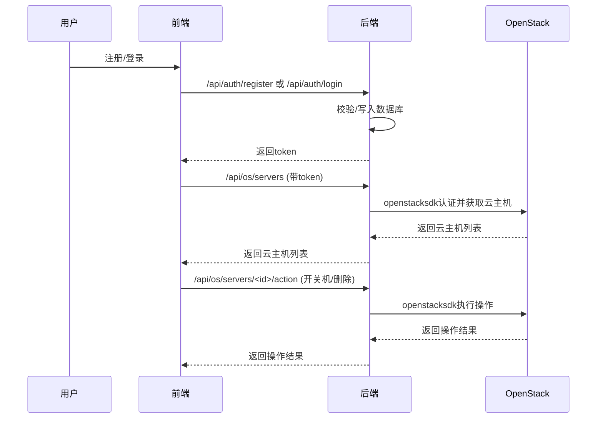

# OpenStack Web 控制平台项目结构与实现方法

## 一、项目简介

本项目实现了一个**自有用户系统**的 OpenStack 云主机管理平台，支持用户注册、登录，并通过 OpenStack API 实现云主机的开关机、删除等操作。采用**前后端分离**架构，后端基于 Flask，前端基于 React，后端通过 openstacksdk 调用 OpenStack 资源，前端通过 RESTful API 与后端交互。

---

## 二、系统架构



- **前端**：React 实现，负责用户界面、交互、API 调用。
- **后端**：Flask 实现，负责用户注册/登录、JWT鉴权、OpenStack资源操作API。
- **数据库**：SQLite（可扩展为MySQL/PostgreSQL），存储自有用户信息。
- **OpenStack**：通过 openstacksdk 访问云主机等资源。

---

## 三、详细结构

### 1. 后端结构（backend）

```
backend/
├── app.py                # Flask主入口，注册蓝图
├── auth.py               # 用户注册、登录API
├── config.py             # 配置文件
├── models.py             # SQLAlchemy模型
├── openstack_api.py      # OpenStack资源操作API
├── requirements.txt      # Python依赖
└── README.md             # 后端说明文档
```

#### 主要模块说明

- **app.py**  
  初始化Flask应用，加载配置，注册蓝图，初始化数据库和JWT，启动服务。

- **auth.py**  
  提供`/api/auth/register`和`/api/auth/login`接口，实现用户注册、登录，使用JWT进行鉴权。

- **models.py**  
  定义用户表结构（User），使用SQLAlchemy管理。

- **openstack_api.py**  
  提供`/api/os/servers`（获取云主机列表）、`/api/os/servers/<id>/action`（开关机、删除）等接口，所有接口需JWT鉴权，内部通过openstacksdk调用OpenStack。

- **config.py**  
  配置数据库、JWT密钥等。

---

### 2. 前端结构（frontend）

```
frontend/
├── public/
│   └── index.html
├── src/
│   ├── api.js            # axios封装，统一API地址
│   ├── App.js            # 路由与主逻辑
│   ├── Login.js          # 登录页面
│   ├── Register.js       # 注册页面
│   └── Servers.js        # 云主机列表与操作页面
├── package.json          # 前端依赖
└── README.md             # 前端说明文档
```

#### 主要模块说明

- **api.js**  
  配置axios实例，统一API请求地址。

- **App.js**  
  控制页面路由和登录状态，未登录显示登录/注册，已登录显示云主机管理。

- **Login.js/Register.js**  
  用户登录、注册表单，调用后端API。

- **Servers.js**  
  展示云主机列表，提供开机、关机、删除操作按钮，操作后自动刷新。

---

### 3. 数据流与交互流程

1. **用户注册/登录**
   - 前端调用 `/api/auth/register` 或 `/api/auth/login`，后端校验并返回JWT token。
   - 前端保存token，后续API请求带上`Authorization: Bearer <token>`。

2. **云主机管理**
   - 前端调用 `/api/os/servers` 获取云主机列表。
   - 用户点击操作按钮，前端调用 `/api/os/servers/<id>/action`，传递操作类型（start/stop/delete）。
   - 后端用openstacksdk连接OpenStack，执行对应操作，返回结果。

---

### 4. 部署结构

- **前端**：本地构建后（npm run build），静态文件部署到Nginx或Apache，供用户访问。
- **后端**：Flask服务部署在服务器（可用gunicorn+systemd），监听5001端口，供前端API调用。
- **数据库**：默认SQLite，生产可切换为MySQL/PostgreSQL。
- **OpenStack**：后端服务器需能访问OpenStack API（Keystone、Nova等）。

---

### 5. 关键实现要点

- **前后端分离**，接口通过JWT鉴权，安全性高。
- **自有用户系统**，不依赖OpenStack自带用户，便于扩展。
- **openstacksdk调用**，兼容OpenStack多版本API。
- **接口RESTful**，易于前端调用和后续扩展。
- **可扩展性强**，后续可增加更多OpenStack资源管理功能。

---

### 6. 典型流程图



---

### 7. 适用场景

- 需要自定义用户体系的OpenStack管理平台
- 只开放部分OpenStack资源操作给特定用户
- 需要前后端分离、易于二次开发的云平台管理界面

---

如需更详细的**代码注释**、**接口文档**、**部署脚本**等，欢迎随时补充需求！ 